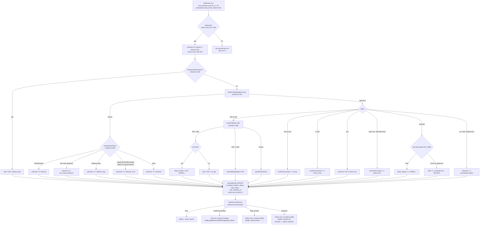
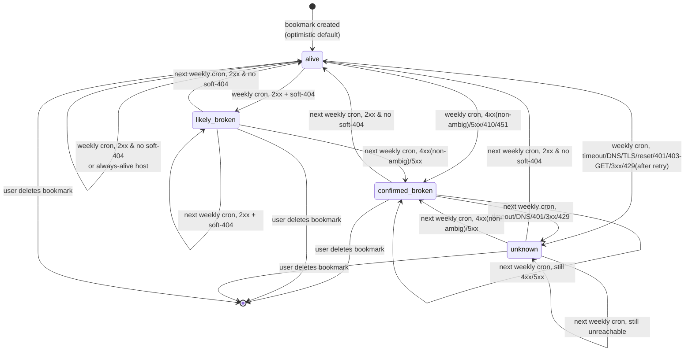

# Broken-Link Detection — E2E State-Machine Audit

> A read-only audit. **No code changes are proposed for execution.** Every claim is
> grounded in the current source with `file:line`. "Observed behavior" is what the
> code does today; "Recommendation" is a suggestion only.
>
> The codebase has **already removed manual override** (migration
> `20260720000000_remove_manual_override.sql` + ADR-0002). Section 7's premise is
> therefore already met by the current code; the "recommended final machine" is the
> minimal deterministic form of what exists today.

---

## 0. Ground Truth — the persisted state type

The system has exactly **one** persisted enum, `bookmarks.broken_status`, with **4
values**. Proven in five places:

| Where                                   | Ref                                                                   |
| --------------------------------------- | --------------------------------------------------------------------- |
| Detection type                          | `lib/link-health/checker.ts:31-35`                                    |
| UI type (duplicate)                     | `lib/utils/broken-link.ts:17-21`                                      |
| Literal array                           | `lib/utils/broken-link.ts:23-28` `BROKEN_STATUSES`                    |
| Zod schema (default `alive`)            | `lib/schemas/bookmark.schema.ts:15`                                   |
| DB CHECK constraint (current, 4 values) | `supabase/migrations/20260720000000_remove_manual_override.sql:37-44` |
| DB default                              | `...003810_add_bookmark_link_health.sql:42-43` (`DEFAULT 'alive'`)    |

`BrokenStatus = "alive" | "confirmed_broken" | "likely_broken" | "unknown"`

A non-presence test explicitly asserts `manual_override` is gone:
`lib/__tests__/link-health.test.ts:291-305`.

Legacy derived boolean: `is_broken = (broken_status ∈ {confirmed_broken, likely_broken})`
(`scripts/check-urls.ts:137-139` `isBrokenStatus`).

---

## 1. Current State Machine

### 1.1 States

| State              | Meaning                                                               | `is_broken` | Reachable in `checkUrl`? |
| ------------------ | --------------------------------------------------------------------- | ----------- | ------------------------ |
| `alive`            | 2xx with no soft-404, or always-alive domain                          | `false`     | yes                      |
| `confirmed_broken` | authoritative 4xx/5xx (404, 410, 451, 5xx, 4xx)                       | `true`      | yes                      |
| `likely_broken`    | 2xx **but** soft-404 heuristic fired                                  | `true`      | yes                      |
| `unknown`          | timeout / DNS / TLS / reset / 401 / 403-after-GET / 429-… / 3xx / 1xx | `false`     | yes                      |

All four states are reachable; no fifth state exists.

### 1.2 Transitions (observed behavior)

A single `checkUrl(url)` call is purely functional — **it does not depend on the
previous persisted state.** There is no read-then-conditional-write. Whatever
`checkUrl` returns overwrites the persisted row wholesale
(`scripts/check-urls.ts:148-157`). So "transitions" are really "classification →
persisted overwrite." The previous state is irrelevant on every cron run.

| #   | Input event in `checkUrl`                                           | Next state              | `is_broken`                | `http_status` | `reason`             | Ref                                            |
| --- | ------------------------------------------------------------------- | ----------------------- | -------------------------- | ------------- | -------------------- | ---------------------------------------------- |
| T1  | host ∈ `ALWAYS_ALIVE_DOMAINS` (no network)                          | `alive`                 | false                      | 200           | `always_alive`       | `checker.ts:429-436`                           |
| T2  | HEAD throws → `AbortError`/`aborted`                                | `unknown`               | false                      | 0             | `timeout`            | `checker.ts:211-221`                           |
| T3  | HEAD throws → `Too many redirects` msg                              | `unknown`               | false                      | 0             | `too_many_redirects` | `checker.ts:222-229`                           |
| T4  | HEAD throws → `Redirect loop` msg                                   | `unknown`               | false                      | 0             | `redirect_loop`      | `checker.ts:230-237`                           |
| T5  | HEAD throws → `TypeError`/`DOMException` (DNS, TLS, reset, refused) | `unknown`               | false                      | 0             | `network_error`      | `checker.ts:238-246`                           |
| T6  | HEAD throws → other Error                                           | `unknown`               | false                      | 0             | `unknown`            | `checker.ts:247-252`                           |
| T7  | HEAD 405 or 403 → GET fallback → GET `<400` → no soft-404           | `alive`                 | false                      | GET status    | `ok_get`             | `checker.ts:456-462`, `353-371`                |
| T8  | HEAD 405 or 403 → GET fallback → GET `<400` → **soft-404**          | `likely_broken`         | true                       | GET status    | `soft404_*`          | `checker.ts:458-459`, `506-513`                |
| T9  | HEAD 405/403 → GET fallback → GET `≥400`                            | (GET status classified) | per `classifyByHttpStatus` | GET status    | `fallback_get`       | `checker.ts:474-477`, `tryGetFallback:364-367` |
| T10 | HEAD 410 or 451                                                     | `confirmed_broken`      | true                       | status        | `gone`               | `checker.ts:465-473`                           |
| T11 | HEAD ≥500                                                           | `confirmed_broken`      | true                       | status        | `server_error`       | `checker.ts:474-477`, `185-187`                |
| T12 | HEAD 401                                                            | `unknown`               | false                      | 401           | `client_error`       | `checker.ts:474-477`, `182-184`                |
| T13 | HEAD other 4xx (400, 402, 404, 405-handled, 406…499 ex. 410/451)    | `confirmed_broken`      | true                       | status        | `client_error`       | `checker.ts:474-477`, `188-190`                |
| T14 | HEAD 429 after exhausting retries                                   | `confirmed_broken`      | true                       | 429           | `client_error`       | `checker.ts:474-477` + `http-fetch.ts:21`      |
| T15 | HEAD 200–299 → soft-404 probe fires                                 | `likely_broken`         | true                       | HEAD status   | `soft404_*`          | `checker.ts:481-483`, `405-413`                |
| T16 | HEAD 200–299 → probe does not fire                                  | `alive`                 | false                      | HEAD status   | `ok`                 | `checker.ts:484-489`                           |
| T17 | HEAD 1xx or residual 3xx (e.g. 304)                                 | `unknown`               | false                      | status        | `unexpected_status`  | `checker.ts:492-498`                           |

### 1.3 Retry / fallback / timeout / redirect / soft-404 sub-behaviors

- **Retry** lives entirely inside `httpFetch` → `attemptWithRetry`
  (`lib/utils/http-fetch.ts:101-148`).
  - Up to **2 retries** (3 total attempts), `DEFAULT_RETRIES=2` (`:18`), mirrored by
    `checker.ts:46` `MAX_RETRIES=2` and `check-urls.ts:56`.
  - Retried on response status ∈ `retryOnStatus` = `[429, 500, 502, 503]` (`:21`).
  - **504 is NOT in the retry list** — a single 504 → `confirmed_broken` (T11 path).
  - Retried on throw iff `isRetryableError(err)` → `TypeError`, `AbortError`,
    `DOMException` (`:391-399`). `SyntaxError`/`ReferenceError` are **not** retried
    (asserted `http-fetch.test.ts`).
  - Backoff: `parseRetryAfter(response) ?? min(1000·2^attempt, 5000)` (`:125`),
    and `min(1000·2^attempt, 5000)` on throw (`:139`). Cap 5s.
  - **Retry-After** parsed for seconds and HTTP-date, **capped at 30 s**
    (`parseRetryAfter:155-173`).
  - **Soft-404 probe disables retry**: `retries: 0` (`checker.ts:389`). The probe
    failing just yields the HEAD `2xx → alive` verdict (`logger.warn`, return
    `null`, `checker.ts:414-417`).

- **HEAD → GET fallback** (`tryGetFallback`, `checker.ts:353-371`) triggers **only on
  HEAD 405 or 403** (`:456`). It is a real GET (full body, `Accept: text/html`),
  **not** the 8 KB Range probe. If GET returns `<400` → re-runs soft-404 detection
  via `maybeDowngradeToSoft404` (`:458-459`).

- **Timeout**: 10 s hard wall via `AbortController`
  (`executeWithTimeout:69-93`; `DEFAULT_TIMEOUT=10_000 :17`; `checker.ts:45`;
  `check-urls.ts:55`). Exceeding it throws `AbortError` → T2. Timeouts **are
  retried** (retryable), so worst case ≈ 3 × 10 s before `unknown`.

- **Redirect**:
  - `checkUrl` uses `followRedirect: true` → native `fetch` `redirect: "follow"`
    (`http-fetch.ts:297-312`). The redirect cap is the **runtime's** limit (not this
    code's). The in-code `DEFAULT_MAX_HOPS=5` (`:20`) and the loop/`Too many
redirects` detection (`followRedirectsManually:179-242`) apply **only** to the
    manual `followRedirect: { maxHops }` mode, which **`checkUrl` never uses**. The
    custom redirect-loop detection is effectively **dead code for the cron path.**
  - `httpFetch` returns `finalUrl` (`response.url`), but `checkUrl` discards it
    (`const { response } = result` at `:446`; only `response` is used). The
    soft-404 probe re-GETs the **original** `url` (`checker.ts:386`), not the final
    URL — so a redirect to a parked/404 page is assessed against the original URL.

- **Soft-404** (`detectSoft404`, `checker.ts:294-341`). All structural signals are
  **gated on `body.length < 4000`** (`SOFT_404_BODY_LENGTH_THRESHOLD :103`,
  `bodyIsShort :302`). Body is fetched as `Range: bytes=0-8192` and capped at 8192
  bytes on read (`:392`, `:400`). Detection order:
  1. short body + JSON error payload → `soft404_json_error` (`:318-321`)
  2. short body + canonical → `/404`|`/not-found`|`/page-not-found` →
     `soft404_canonical` (`:323-325`)
  3. short body + CSS class `error-page|page-404|not-found-page|page-not-found` →
     `soft404_error_class` (`:326-328`)
  4. body keyword **and** `<title>` 404-shaped → `soft404_combined` (`:331-333`)
  5. body keyword alone (**short only**) → `soft404_body_keyword` (`:336`)
  6. `<title>` 404-shaped **and short** → `soft404_title` (`:337-339`)

---

## 2. E2E Decision Tree (bookmark-in → DB-write → UI)

UI gate: `BrokenLinkWarning` renders nothing if `autoCheckBroken` is falsy
(`broken-link-warning.tsx:27`) or `showWarning` is false (`:34`). Severity→color:
`warning`→`text-red-500`, `subtle`→`text-amber-500/80` (`:36-55`). Mapping
`broken_status → RenderableBrokenState` is in `resolveBrokenState`
(`lib/utils/broken-link.ts:94-130`); `getBrokenLinkMessage` text at `:48-62`.

**Note on the only two writers of link-health state** (verified by grep):

1. optimistic UI add → `broken_status:"alive", is_broken:false, http_status:null`
   (`lib/mutations/bookmark.mutations.ts:42-45`) — every bookmark is **born alive**;
2. weekly cron `persistResult` (`scripts/check-urls.ts:144-167`) — the only real
   re-evaluator. **No interactive mutation ever sets broken/is_broken/http_status.**

---

## 3. State Transition Matrix

Unique by event → next-state (current-state is irrelevant — see §1.2). Persisted &
UI columns apply once the cron has written.

| #   | Event (input condition / HTTP·network event)       | Next state                      | Persisted? | `is_broken` | UI outcome                    |
| --- | -------------------------------------------------- | ------------------------------- | ---------- | ----------- | ----------------------------- |
| T1  | host ∈ always-alive allowlist                      | `alive`                         | yes (200)  | false       | hidden                        |
| T2  | fetch `AbortError` (timeout, ≤10s, after retries)  | `unknown`                       | yes (0)    | false       | amber, "Couldn't be reached…" |
| T3  | `Too many redirects` thrown                        | `unknown`                       | yes (0)    | false       | amber                         |
| T4  | `Redirect loop` thrown                             | `unknown`                       | yes (0)    | false       | amber                         |
| T5  | `TypeError`/`DOMException` (DNS/TLS/reset/refused) | `unknown`                       | yes (0)    | false       | amber                         |
| T6  | other thrown Error                                 | `unknown`                       | yes (0)    | false       | amber                         |
| T7  | HEAD 405/403 → GET `<400`, no soft-404             | `alive`                         | yes (GET)  | false       | hidden                        |
| T8  | HEAD 405/403 → GET `<400`, soft-404                | `likely_broken`                 | yes (GET)  | true        | amber "Likely broken…"        |
| T9  | HEAD 405/403 → GET `≥400`                          | per `classifyByHttpStatus(GET)` | yes        | per status  | per status                    |
| T10 | HEAD 410 / 451                                     | `confirmed_broken`              | yes        | true        | red                           |
| T11 | HEAD 5xx (retried 500/502/503; 504 NOT retried)    | `confirmed_broken`              | yes        | true        | red                           |
| T12 | HEAD 401                                           | `unknown`                       | yes (401)  | false       | amber                         |
| T13 | HEAD other 4xx (404 etc.)                          | `confirmed_broken`              | yes        | true        | red                           |
| T14 | HEAD 429 after all retries exhausted               | `confirmed_broken`              | yes (429)  | true        | red ("Error (429)")           |
| T15 | HEAD 2xx + soft-404 probe fires                    | `likely_broken`                 | yes (HEAD) | true        | amber                         |
| T16 | HEAD 2xx + no soft-404                             | `alive`                         | yes        | false       | hidden                        |
| T17 | HEAD 1xx / residual 3xx (e.g. 304)                 | `unknown`                       | yes (s)    | false       | amber                         |

**Determinism.** For a _fixed_ set of fetch outcomes the function is deterministic —
it is a pure classifier with no dependence on prior state. Non-determinism sources
in practice (observable across runs):

- the 10 s timeout race vs. server latency;
- runtime native-redirect cap and behavior (auto-follow; this code does not control
  it);
- the soft-404 probe issues a **separate** GET whose body may differ from a user's
  browser view, and (with `Range`) may be refused/modified by the server;
- server-side variance (429 sometimes, 200 otherwise; Cloudflare challenge
  sometimes, 403 otherwise).

**Reachability.** All 4 states are reachable. No column is "Persisted? = no" —
every terminal classification is written by `persistResult` (the optimistic add is
only the birth state). The two most specific error reasons in `classifyFetchError`
(`too_many_redirects`, `redirect_loop`) are **not reachable** on the cron path:
`checkUrl` uses native auto-follow, and the loop-detection code only runs in the
manual `{maxHops}` mode that nothing invokes. Under auto-follow, a loop surfaces as
T5 (`network_error`) or a native redirect error — never as T3/T4.

---

## 4. Algorithm Coverage

| Event class               | How the current algorithm handles it                                                                                                                                                                         | Final state (typical)                                   |
| ------------------------- | ------------------------------------------------------------------------------------------------------------------------------------------------------------------------------------------------------------ | ------------------------------------------------------- |
| **2xx**                   | HEAD 2xx → soft-404 probe (GET 0–8 KB). If short body + notfound signal → `likely_broken`; else `alive` (`checker.ts:481-490`)                                                                               | `alive` / `likely_broken`                               |
| **3xx**                   | Auto-followed by native `fetch`. Final-status assessed normally. A residual 3xx (304 Not Modified) → `unknown unexpected_status` (`checker.ts:492-498`)                                                      | depends; 304 → `unknown`                                |
| **4xx**                   | 405/403 → GET fallback. 410/451 → `gone`. 401 → `unknown`. All other 4xx → `confirmed_broken client_error` (`:474-477`, `classifyByHttpStatus`)                                                              | `confirmed_broken` / `unknown`                          |
| **5xx**                   | Retried only for 500/502/503 then → `confirmed_broken server_error`. **504 NOT retried** (`http-fetch.ts:21`)                                                                                                | `confirmed_broken`                                      |
| **DNS failure**           | `TypeError` → `unknown network_error`; retried up to 2× first (`:238-246`, `:393`)                                                                                                                           | `unknown`                                               |
| **TLS failure**           | `TypeError`/`DOMException` → `unknown network_error`; retried (`:393,397`)                                                                                                                                   | `unknown`                                               |
| **Timeout**               | `AbortError` after 10 s → `unknown timeout`; retried (`:211-221`, `:395`)                                                                                                                                    | `unknown`                                               |
| **Connection reset**      | `TypeError`/`DOMException` → `unknown network_error`; retried                                                                                                                                                | `unknown`                                               |
| **Redirect loops**        | **Manual-mode** code detects loops (visited-set, `:199-204` & `:222-225`), but `checkUrl` uses auto-follow and never invokes it. Under auto-follow a loop becomes a native error → typically `network_error` | `unknown` (as `network_error`, **not** `redirect_loop`) |
| **Login walls**           | Not detected by HTML inspection. A 401 → `unknown`; a 200 behind-cookie-auth would pass as `alive`; a `200` login interstitial with `<title>Sign in` is **not** in the soft-404 keyword set → `alive`        | `alive` / `unknown`                                     |
| **Cloudflare / anti-bot** | No header/HTML detection. A 403 → GET fallback (often works); 200 challenge page with "Just a moment…" is not a soft-404 keyword → `alive`.                                                                  | `alive` / `unknown`                                     |
| **Rate limiting (429)**   | Retried w/ `Retry-After` (cap 30 s), default backoff. **Terminal 429 → `confirmed_broken`** (`:474-477` + `:21`) — a known mis-classification                                                                | `confirmed_broken`                                      |
| **Always-alive domains**  | 9 hardcoded hosts (twitter/x/nitter/youtube/youtu.be/instagram/tiktok/facebook/fb). Exact hostname or `.subdomain` match → synthetic `alive 200` **no network** (`:53-63`, `:153-159`)                       | `alive`                                                 |
| **Soft-404 pages**        | Multi-signal, short-body gated: JSON error, canonical-/404, error-page CSS class, keyword+title, keyword-only (short), title-only (short) → `likely_broken` (`:294-341`)                                     | `likely_broken`                                         |

---

## 5. False Positive / False Negative Analysis (per rule)

### R-A. Always-alive short-circuit (`checker.ts:429-436`, `:53-63`)

- _Why:_ these hosts wall off bots; HEAD/GET proves nothing about a specific resource.
- _FP prevented:_ bot-walled platforms never flagged as broken.
- _FN introduced:_ a genuinely deleted tweet / unlisted YouTube video is reported
  **alive forever** — `http_status=200` is synthetic, no check ever occurs.
- _Confidence:_ **high** the domain is up; **zero** the specific resource exists.

### R-B. 401 / 403 → `unknown` (`classifyByHttpStatus:182-184`, ADR-0002)

- _Why:_ on a public URL these usually mean bot-detection or auth-walling, not "gone."
- _FP prevented:_ legit auth-walled/bot-blocked sites not marked `confirmed_broken`.
- _FN introduced:_ a page that genuinely moved behind required-auth (was public) is
  read as `unknown`, not broken.
- _Confidence:_ **medium**. The 403-HEAD path additionally tries GET (T7–T9),
  recovering some of these to `alive`.

### R-C. 410 / 451 → `confirmed_broken gone` (`checker.ts:466-473`)

- _Why:_ explicit "deliberately gone" codes.
- _FP prevented:_ low FP (the server is explicit).
- _FN introduced:_ 451 geofence/llegal-takedown may be transient/regional but read as
  definitively broken.
- _Confidence:_ **high**.

### R-D. 5xx → `confirmed_broken` (retried only for 500/502/503) (`:185-187`, `http-fetch.ts:21`)

- _Why:_ server-side failure on a public resource is usually real.
- _FP prevented:_ transient blips reduced by retry on 500/502/503.
- _FN introduced:_ none (aggressive by design).
- _FP risk:_ **504 is not retried** → a single gateway-timeout = `confirmed_broken`.
  Also a long outage window up to weekly-cron cadence keeps a row red until next run.
- _Confidence:_ **medium**. Retry softens most 5xx FP; 504 is the hole.

### R-E. Other 4xx → `confirmed_broken client_error` (`:188-190`)

- _Why:_ 404 and friends are authoritative absence.
- _FP prevented:_ low FP for 404.
- _FN introduced:_ 408 (timeout), 425 (Too Early), 429 (rate-limited) all collapse to
  `confirmed_broken`. **429-confirmed is a flagged FP** (T14, §4).
- _Confidence:_ **high** for 404; **low** for 408/425/429.

### R-F. Soft-404 short-body gate (<4 KB) (`:103`, `:302`)

- _Why:_ real 2xx pages are usually >4 KB; the gate kills the old FP class of
  articles that merely _discuss_ 404s (`checker.ts:99-101`).
- _FP prevented:_ prose about "page not found" not flagged.
- _FN introduced:_ **large** soft-404 pages (>4 KB) with genuine not-found content are
  never detected — the strongest soft-404 signals are silently disabled once the body
  crosses 4 KB.
- _Confidence:_ **medium**. Tunable; 4 KB is a blunt threshold.

### R-G. Soft-404 keyword-only / title-only (short) (`:331-339`)

- _Why:_ either signal alone can be noisy; combined (`soft404_combined`) is the
  trusted rule, singletons kept weaker.
- _FP prevented:_ somewhat (gated on short body).
- _FN introduced:_ short legit pages containing "not available" / title "404" in a
  differently-meaning context can be flagged.
- _Confidence:_ **medium-low** for the singleton branches.

### R-H. Errors → `unknown` (never `alive`, never `confirmed`) (`:208-253`, ADR)

- _Why:_ the prior design collapsed every throw into `is_broken:false` (alive) — a
  timeout looked healthy forever (`:19-22`).
- _FP prevented:_ a transient network blip can never look "healthy"; it surfaces amber
  `unknown` instead of being silently hidden.
- _FN introduced:_ a truly **dead / parked / firewalled** domain reads `unknown`
  forever and is **never escalated to `confirmed_broken`** — there is no
  consecutive-failure counter. The deliberate tradeoff is "never make false claims";
  the cost is no progress for permanently-down hosts.
- _Confidence:_ **high** that "we don't know." (Intent, not a bug; but worth an
  escalation ladder — see §6.)

### R-I. HEAD→GET fallback only on 405/403 (`:456-462`, `:353-371`)

- _Why:_ some servers/CDNs reject HEAD with 403/405; a real GET usually works.
- _FP prevented:_ HEAD-blocking servers not misclassified.
- _FN introduced:_ a server returning **HEAD 401** is NOT given a GET fallback
  (T12 → `unknown`), even though GET might have returned 200.
- _Confidence:_ **medium**.

### R-J. finalUrl discarded + soft-404 probe on original URL (`:446`, `:386`)

- _Why (incidental):_ the orchestrator only needs `response`; `finalUrl` unused.
- _FP prevented:_ none.
- _FN introduced:_ a 2xx that redirects to a parked/404 page is probed against the
  **original** URL (re-following), so a once-parked redirect target may be re-fetched
  fresh and escape detection; canonical detection is body-based, mitigating partly.
- _Confidence:_ **low** impact; mostly correct due to re-follow.

---

## 6. Improvement Roadmap (no code changes — suggestions ordered by impact)

> All items are **recommendations**, each independently optional. Nothing here is
> staged for execution.

### Algorithm

1. **Classify terminal 429 as `unknown`, not `confirmed_broken`** (R-E, T14). Today a
   rate-limited host is painted red until the next cron. Add 429 to
   `AMBIGUOUS_CLIENT_STATUSES` (or an explicit "rate_limited → unknown" branch).
   _Highest FP return._
2. **Add 504 to retry statuses** (`http-fetch.ts:21`). A single 504 currently →
   `confirmed_broken` (R-D). Adding `504` to `DEFAULT_RETRY_STATUSES` removes the one
   un-retried transient 5xx.
3. **Escalation ladder for persistent `unknown`** (R-H). Track a small
   `consecutive_unknown_count`; after N weekly runs of pure network failure on the
   same host, the row could be surfaced more prominently (still not asserted
   broken). Kept optional to preserve the "no false claims" stance.
4. **Classify 408/425 as `unknown`** (R-E) — same rationale as 429.
5. **Treat `.onion`/non-routable hosts** — currently surfaced only via DNS failure;
   consider a prefilter that marks them `unknown` without burning retries/timeout.

### Heuristics

6. **Adaptive soft-404 threshold** (R-F): 4 KB is blunt. Either (a) scale the gate to
   `Content-Length` when present, or (b) additionally treat an empty-ish 200
   (e.g. `<200 bytes`) as suspect. Reduces the ">4 KB real soft-404" FN.
7. **Login-wall / parking-page signals** (§4): optional detection of
   `meta refresh` to `/login`, canonical self-reference as an _alive_ signal, and
   known parked-domain signatures (sedoparking etc.). Deliberately conservative —
   each new signal is itself an FP source.
8. **Self-canonical as an _alive_ vote**: a `<link rel=canonical href=currentUrl>`
   actively argues _not_ soft-404; today only the negative ("canonical → /404") is
   used.

### Reliability

9. **Persist `reason`** (and a `last_check_error`/`consecutive_unknown_count`).
   Today only `broken_status`/`http_status`/`last_checked_at` are written
   (`check-urls.ts:151-154`). Without `reason`, FP debugging is blind — you cannot
   tell a `soft404_combined` `likely_broken` from a parking page.
10. **Give the soft-404 probe 1 retry** (`checker.ts:389` `retries:0`). A single
    network blip during the probe silently downgrades `likely_broken` candidates to
    `alive`.
11. **Use `finalUrl`** for the soft-404 probe and for classification (R-J), so a
    redirect to parked/404 is assessed at its true destination.

### Performance

12. **Skip the soft-404 probe when `Content-Length` is large** from the HEAD response
    (many servers send it). Avoids a second round-trip on obviously-large 2xx.
13. **Per-host throttle already exists** (`runWithPerHostConcurrency`,
    `check-urls.ts:85-135`, 1/host, global 10). Effective concurrency for
    few-host batches is host-limited (ADR-0002 notes 100 bookmarks/5 hosts ≈ 5 at a
    time). No change suggested; document the tradeoff.

### Scalability

14. **Throughput ceiling:** `MAX_BOOKMARKS_PER_RUN=500` weekly
    (`check-urls.ts:57,58`). At >~26 000 bookmarks a single weekly run cannot cycle
    the backlog; staleness grows unbounded. Either raise the cap, shard by host, run
    more than weekly, or add a secondary on-demand run — the _simplest_ honest fix is
    to log how many _eligible_ bookmarks were left unchecked each run (today the
    script logs only how many it checked).

### Observability

15. **Emit per-`reason` counts in the run summary** (`check-urls.ts:221-230` only
    logs checked/broken/likely/unknown). Splitting `unknown` into
    `timeout`/`network_error`/`rate_limited`/`auth` makes regressions visible.
16. **Log "eligible but capped"** count, exposing the scalability gap above.
17. **Add a redirect-path/`finalUrl` ≠ original diff** count to catch
    redirect-to-parked patterns.

---

## 7. Recommended Final State Machine (manual override already removed)

> The codebase **already** removed `manual_override` (migration
> `20260720000000`, ADR-0002). So this is the _minimal deterministic_ form of the
> machine that exists today, with two small classifying fixes (§6 #1, #2) folded in
> as the simplest honest state. These are the _only_ behavioral changes implied by
> "simplest deterministic."

### 7.1 Proposed machine

Four states, weekly cron, **every** run overwrites unconditionally — no sticky
override, no skip-once-seen-broken logic:

### 7.2 "Simplest deterministic" rules (4)

| Rule                 | Condition → state                                                                                                                                     |
| -------------------- | ----------------------------------------------------------------------------------------------------------------------------------------------------- |
| **ALIVE**            | 2xx **and** not soft-404; **or** host ∈ always-alive allowlist                                                                                        |
| **CONFIRMED_BROKEN** | 410 / 451; **or** other 4xx ∉ {401, 403\*, 408, 425, 429}; **or** 5xx                                                                                 |
| **LIKELY_BROKEN**    | 2xx **and** soft-404 (short-body gated)                                                                                                               |
| **UNKNOWN**          | timeout / DNS / TLS / reset / refused; **or** 401; **or** 403 after GET-fallback; **or** 408 / 425; **or** 429 after retry; **or** residual 3xx / 1xx |

(\*403 on HEAD triggers GET fallback first; only the GET result is classified — if
GET is also 403 → `unknown`.)

### 7.3 What "removed manual override" removes from the machine

- No `manual_override` state, no `manually_marked_alive_at` column, no
  `isManualOverrideStale`/`markBookmarkAlive` paths — all already gone
  (ADR-0002 confirms the old expiry helper was **dead code** the cron never called).
- Every weekly run is a **clean overwrite**; there is no "skip this row because the
  user dismissed it." A `confirmed_broken` link that recovers flips back to `alive`
  on the next cron with no human action (this already works today).
- No user-facing escape hatch exists for FP (the explicit trade ADR-0002 made); the
  mitigation is detection accuracy, hence §6 #1 (429→unknown) and #2 (retry 504).

### 7.4 Determinism & simplicity check for the recommended machine

- **No state-dependent branching.** classification is a pure function of the latest
  fetch outcome; the persisted previous state is never read by `checkUrl`.
- **No hidden transitions.** The four rules above cover every terminal; nothing
  branches on "was it broken last week."
- The only deviations from _today's_ code that this recommendation introduces are the
  two FP fixes (terminal 429 → `unknown`; retry 504). Everything else — the 4-state
  enum, the weekly overwrite discipline, the absence of override — **already matches
  the current code.**

---

## Appendix — How to re-confirm this audit (read-only)

- `grep -rniE "manual_override|manually_marked|markBookmarkAlive" . --exclude-dir=.git --exclude-dir=node_modules`
  → only hits in `docs/` and the non-presence test (`lib/__tests__/link-health.test.ts:291-305`).
- `find supabase -type f` → two migrations; the second (`...remove_manual_override.sql`)
  reduces the CHECK to the 4 values.
- `grep -rn "broken_status\b" lib scripts --include=*.ts | grep -v __tests__` →
  writers limited to the optimistic-add default (`bookmark.mutations.ts:44-45`) and
  cron persist (`check-urls.ts:152`).
- `bun test lib/__tests__/link-health.test.ts lib/__tests__/http-fetch.test.ts lib/__tests__/utils-extra.test.ts`
  reproduces the input→output table in §1.2/§3 (the tests are the ground truth for
  each classification branch).

## Key files (all paths absolute)

- `lib/link-health/checker.ts` — `checkUrl`, `classifyByHttpStatus`, `classifyFetchError`, `detectSoft404`, always-alive + soft-404 constants
- `lib/utils/http-fetch.ts` — retry, timeout, Retry-After, redirect modes, `readResponseBody`
- `lib/utils/broken-link.ts` — `BrokenStatus`, `BROKEN_STATUSES`, `getBrokenLinkMessage`, `resolveBrokenState`, `normalizeStatus`
- `lib/schemas/bookmark.schema.ts` — Zod `broken_status` enum + `is_broken`
- `scripts/check-urls.ts` — cron driver, selection query, `runWithPerHostConcurrency`, `persistResult`, `isBrokenStatus`
- `components/bookmark/broken-link-warning.tsx` — UI render (gates, severity→color)
- `lib/mutations/bookmark.mutations.ts` — optimistic add (only other writer of `broken_status`, set to `alive`)
- `lib/__tests__/link-health.test.ts`, `lib/__tests__/http-fetch.test.ts`, `lib/__tests__/utils-extra.test.ts` — ground-truth cases
- `supabase/migrations/20260719003810_add_bookmark_link_health.sql` — enum + default `alive`
- `supabase/migrations/20260720000000_remove_manual_override.sql` — drops override, 4-value CHECK
- `docs/adr/0001-broken-status-enum.md`, `docs/adr/0002-remove-manual-override.md` — design rationale
- `.github/workflows/check-urls-health.yml` — schedule `0 18 * * 0` + `workflow_dispatch`, `bun scripts/check-urls.ts`
