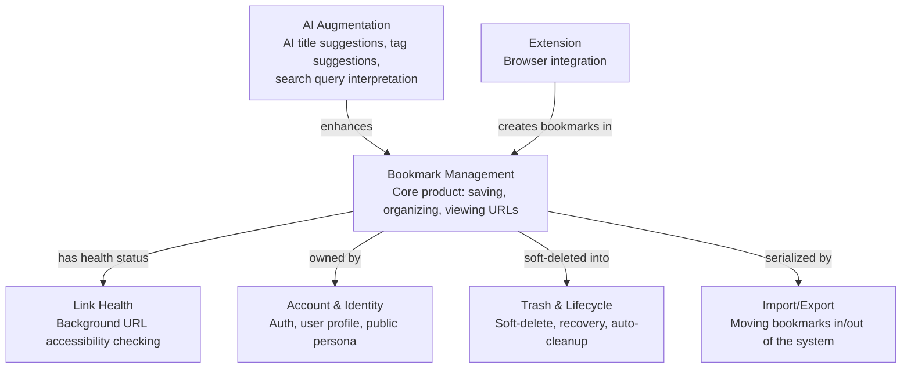
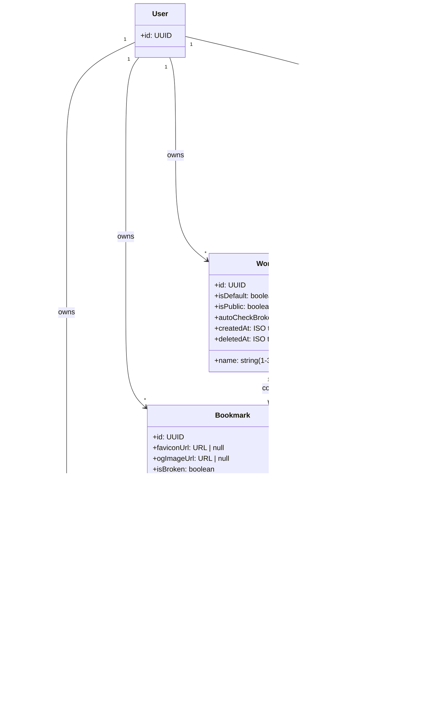
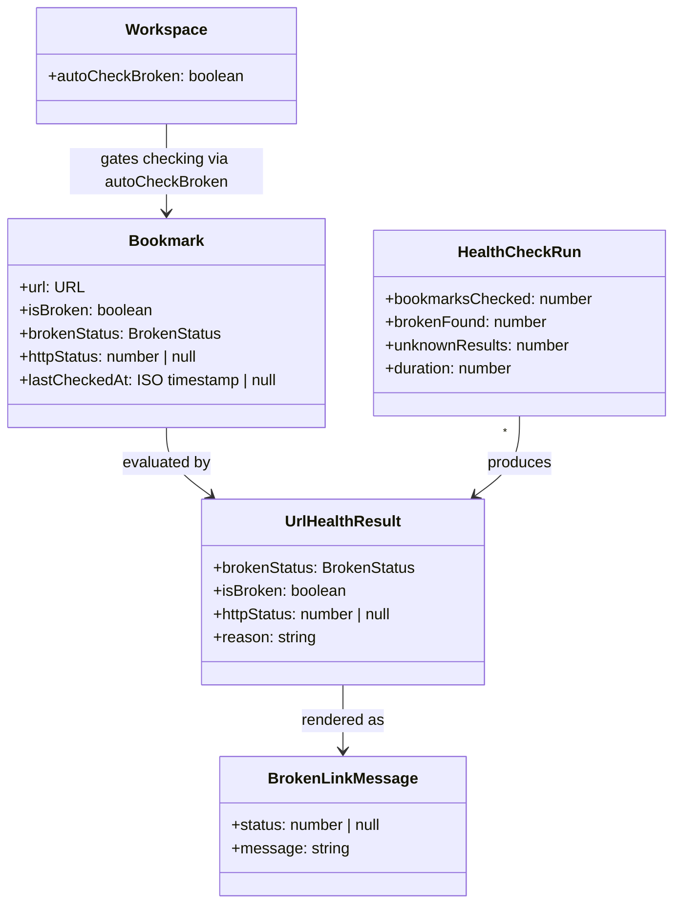
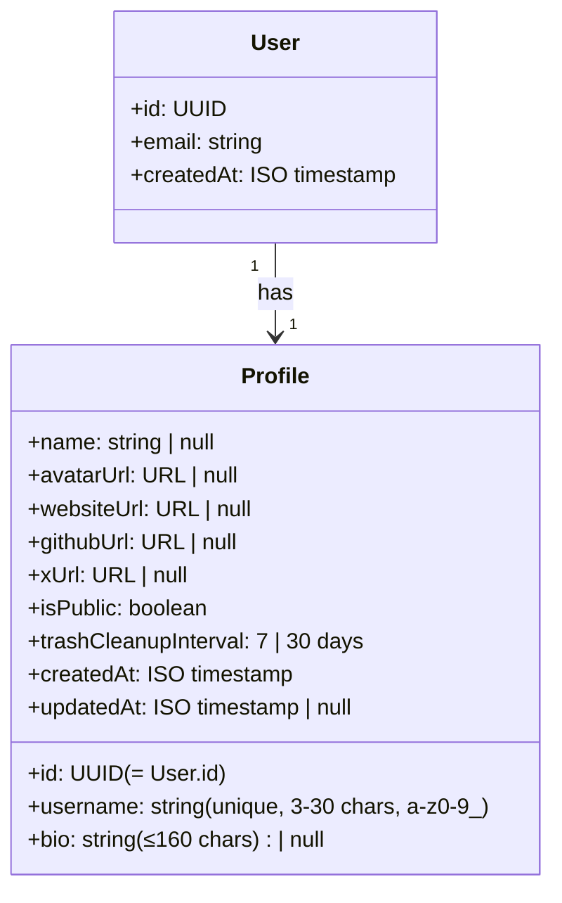
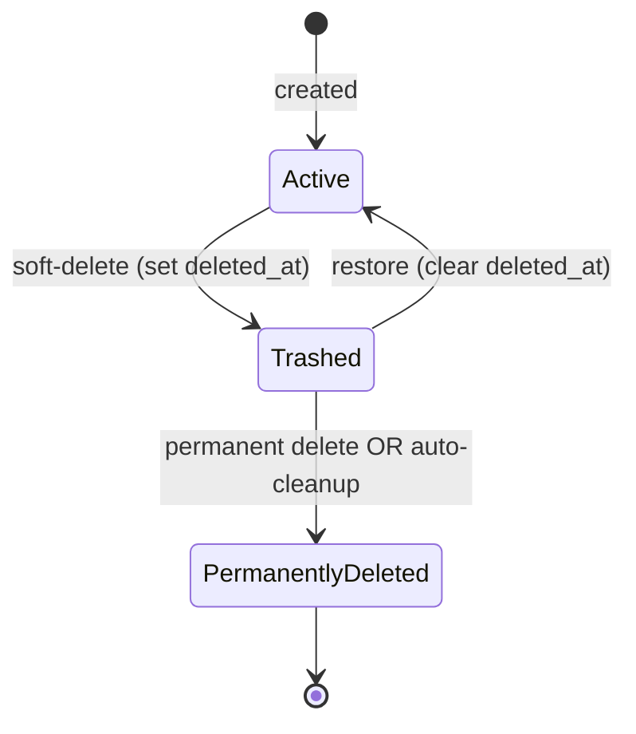
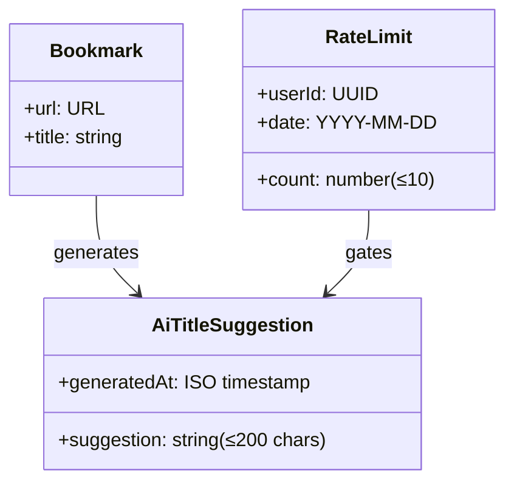
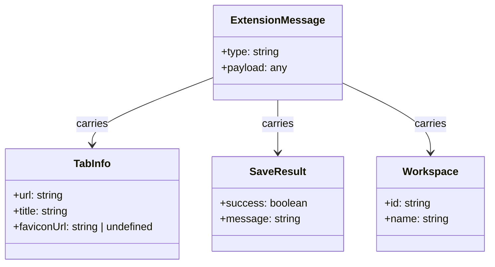

# Sheltermark Domain Model

> Visual companion to [`CONTEXT.md`](../CONTEXT.md). `CONTEXT.md` is the
> canonical source for domain vocabulary and rules; this document adds the
> diagrams, entity models, and cross-context relationships. Where wording
> differs, `CONTEXT.md` wins.

A cross-device bookmark manager: save URLs enriched with fetched metadata,
organize them into workspaces, share public collections.

---

## Bounded Contexts

Sheltermark decomposes into seven bounded contexts, each with its own consistent vocabulary.



---

## 1. Bookmark Management

The core product context. Everything revolves around saving URLs, organizing them into workspaces, tagging them, and viewing them in different modes.

### Core Vocabulary

- **Bookmark** — a saved URL enriched with metadata (title, favicon, OG image, note). The user's fundamental unit of content.
- **Workspace** — a named collection of bookmarks. The user's primary organizational axis. Has visibility (public/private), a default workspace, and an auto-check-broken toggle.
- **Tag** — a lightweight, user-scoped label attached to bookmarks via a many-to-many relationship. Tags are cheap and disposable — hard-delete, no trash.
- **Feed** — an RSS/Atom subscription that creates bookmarks from feed items. A Feed is a _source_ of bookmarks, not a bookmark itself.
- **View Variant** — one of three display modes for a bookmark list: **List** (keyboard-navigable, minimal), **Comfort** (rich with notes/tags/images), **Card** (visual-first with hero image).
- **Metadata** — a value object: `{ title, description, og_image_url, favicon_url }`. Immutable snapshot fetched from a URL at add-time.

### Entity Model



### Invariants

1. **URL uniqueness is per-user, per-workspace.** A user cannot have two active (non-trashed) bookmarks with the same normalized URL in the same workspace.
2. **Tag name uniqueness is per-user.** `(user_id, name)` is the unique key on `tags`. Adding "design" to a second bookmark reuses the existing row.
3. **Every user has exactly one default workspace.** It's created on first sign-in. It cannot be deleted.
4. **Workspace name ≤ 35 chars, bookmark title ≤ 200 chars, note ≤ 2000 chars.** Enforced by Zod schemas at the action boundary.
5. **When a workspace is deleted, all its active bookmarks are soft-deleted together.** This is a transactional invariant.

### Domain Services

| Service                  | Description                                                                                                                                                                                                                                                                                                         |
| ------------------------ | ------------------------------------------------------------------------------------------------------------------------------------------------------------------------------------------------------------------------------------------------------------------------------------------------------------------- |
| **Metadata Fetching**    | Given a URL, return `Metadata`. Multi-strategy pipeline: URL safety check → platform-specific API fallback (fxtwitter for Twitter, YouTube oembed, Microlink for JS-heavy sites) → HTML extraction via Cheerio → favicon resolution (Google S2 fallback). Runs at bookmark creation, feed sync, and manual refetch. |
| **Feed Synchronization** | Parses RSS/Atom feeds into entries, deduplicates by GUID, creates bookmarks from new items. Can be triggered manually, by cron (GitHub Actions every 30 min), or via API webhook.                                                                                                                                   |
| **URL Normalization**    | Strips `www.` prefix, tracking params (UTM, fbclid, gclid, etc.), hash fragments, and trailing slashes from URLs before storage. This normalization is what makes the URL uniqueness invariant work.                                                                                                                |

### Domain Events

| Event                        | Trigger                                                                                     |
| ---------------------------- | ------------------------------------------------------------------------------------------- |
| `BookmarkAdded`              | User submits a URL → normalized, metadata fetched, bookmark created                         |
| `BookmarkMoved`              | Bookmarks moved between workspaces; duplicates in target workspace are skipped and reported |
| `BookmarkEdited`             | Title, note, or tags changed on a single bookmark                                           |
| `BookmarkMetadataRefetched`  | User requests metadata refresh for a bookmark                                               |
| `WorkspaceCreated`           | New workspace created (optionally set as default)                                           |
| `WorkspaceRenamed`           | Workspace name changed                                                                      |
| `WorkspaceVisibilityToggled` | Public/private status flipped                                                               |
| `TagAdded`                   | Tag created-or-reused and attached to a bookmark                                            |
| `TagRemoved`                 | Tag detached from a single bookmark (tag entity persists)                                   |
| `TagRenamed`                 | Tag name changed; all bookmarks see the new name                                            |
| `TagDeleted`                 | Tag permanently removed from system (cascading removal from all bookmarks)                  |
| `FeedSubscribed`             | RSS/Atom URL subscribed; initial bookmark batch created                                     |
| `FeedRefreshed`              | Feed re-parsed; new items create bookmarks, existing GUIDs skipped                          |

---

## 2. Link Health

This context determines whether saved URLs are still accessible. It runs as a background process (weekly cron job).

### Core Vocabulary

- **Health Check** — a single HTTP evaluation of a bookmark's URL, producing a `UrlHealthResult`. Run as a weekly cron job (GitHub Actions).
- **UrlHealthResult** — a value object: `{ brokenStatus: BrokenStatus, isBroken: boolean, httpStatus: number | null, reason: string }`. `isBroken` is derived from `brokenStatus` for backwards compatibility.
- **Broken Status** — a 4-state enum: `alive | confirmed_broken | likely_broken | unknown`. See [ADR-0001](./adr/0001-broken-status-enum.md) and [ADR-0002](./adr/0002-remove-manual-override.md) (the `manual_override` state was removed).
- **Soft 404** — a page that returns HTTP 200 but contains "not found" content. Requires short body (< 4KB) AND (title match OR keyword match OR structural signal) to flag. Structural signals: `class="error-page|page-404|not-found-page"`, canonical URL pointing at `/404` or `/not-found`, JSON error payloads (`{"error": "not found"}`).
- **Always-Alive Domain** — domains known to be walled-garden platforms that reject automated checks. Skipped entirely to avoid false positives. Matched by hostname (not substring), so `api.twitter.com` matches `twitter.com` but `https://evil.com/twitter.com` does not.
- **Ambiguous Status** — HTTP 401 and 403 on a public URL are classified as `unknown` rather than `confirmed_broken`, because they usually mean bot-detection or auth-walling rather than the page being gone.

### Entity Model



### Current Algorithm

The health check algorithm in `scripts/check-urls.ts` (logic in `lib/link-health/checker.ts`):

1. **Query**: Fetch bookmarks in workspaces where `auto_check_broken = true`, not checked in 7 days (max 500/run).
2. **Per-host throttling**: At most one concurrent request per hostname. Global concurrency is capped at 10. Prevents accidental DoS of a single domain and reduces 429s.
3. **Always-Alive Skip**: Walled-garden domains (twitter.com, x.com, instagram.com, youtube.com, facebook.com, etc.) are skipped — returned as `alive`. Matched by hostname, so subdomains (`api.twitter.com`) also skip, but `https://evil.com/twitter.com` does not.
4. **HEAD Request**: HEAD with retries (`MAX_RETRIES = 2`) and redirect following, `TIMEOUT_MS = 10_000`.
5. **GET Fallback**: If HEAD returns 403 or 405 (servers that block HEAD), retry with GET.
6. **Soft 404 Detection**: Requires short body (< 4KB) AND at least one of: body keyword + 404-shaped title, error-page CSS class, canonical URL pointing at `/404` or `/not-found`, or JSON error payload. Any single signal alone (without short body) is insufficient.
7. **Ambiguous Status**: HTTP 401 and 403 are classified as `unknown` (not `confirmed_broken`) — a public URL returning 401/403 usually means bot-detection or auth-walling, not that the page is gone.
8. **Status Classification**: Persists both `broken_status` (the enum) and `is_broken` (legacy boolean derived from it). See [ADR-0001](./adr/0001-broken-status-enum.md) and [ADR-0002](./adr/0002-remove-manual-override.md).

See [ADR-0001](./adr/0001-broken-status-enum.md) for why the binary `is_broken` was replaced with a status enum, and [ADR-0002](./adr/0002-remove-manual-override.md) for why the `manual_override` state was later removed.

### Domain Services

| Service                        | Description                                                                                                                               |
| ------------------------------ | ----------------------------------------------------------------------------------------------------------------------------------------- |
| **URL Health Checker**         | Batch checks URLs with HEAD-then-GET strategy, soft 404 detection, and result persistence. Run as a cron job (weekly via GitHub Actions). |
| **Broken Link Message Mapper** | Maps `http_status` (null, 0, 403, 404, 410, 5xx, 4xx) to human-readable messages for the UI.                                              |

### Domain Events

| Event                     | Trigger                                                                                                       |
| ------------------------- | ------------------------------------------------------------------------------------------------------------- |
| `HealthCheckRunStarted`   | Cron job begins a batch                                                                                       |
| `HealthCheckRunCompleted` | Batch finished; summary logged                                                                                |
| `LinkStatusClassified`    | Single bookmark's `broken_status` updated (one of `confirmed_broken`, `likely_broken`, `unknown`, or `alive`) |
| `ManualOverrideApplied`   | User marks a bookmark alive; subsequent checks skip it                                                        |

---

## 3. Account & Identity

Who the user is as a system principal and as a public persona.

### Core Vocabulary

- **User** — the authenticated principal (managed by Supabase Auth). Has an email or OAuth identity, a session, and a unique UUID.
- **Profile** — the user's public-facing identity: username (unique, 3-30 chars, `[a-z0-9_]+`), display name, avatar, bio (≤160 chars), social links (GitHub, X, website), and a public/private toggle. Also controls `trash_cleanup_interval` (7 or 30 days).
- **Auth Provider** — an external identity source: Google OAuth, email/password. Users can sign in via multiple providers linked to the same Supabase Auth user.
- **Public Page** — the route `/u/[username]` which renders a user's public workspaces and profile information. Not a domain entity per se, but a significant domain concept.

### Entity Model



The User and Profile are a 1:1 relationship. Profile is created automatically when a user first signs in, with a generated username. The profile table is also where trash cleanup preferences live — it acts as the user's "settings store."

### Invariants

1. **Username uniqueness across all users.** Case-insensitive. Changing username requires an availability check.
2. **Public profile visibility gates public page rendering.** If `is_public: false`, the `/u/[username]` route shows a "private profile" state, not the workspaces.
3. **Only public workspaces appear on public pages.** Even if a profile is public, individual workspaces can be private.
4. **Avatar is stored in Supabase Storage.** Upload replaces previous avatar; delete removes it entirely.

### Domain Services

| Service                | Description                                                                                                                                                                                                      |
| ---------------------- | ---------------------------------------------------------------------------------------------------------------------------------------------------------------------------------------------------------------- |
| **Authentication**     | Supabase Auth handles: Google OAuth, email/password sign-in, forgot/reset password flow, session persistence via cookies (SSR middleware). Server actions call `requireAuth()` to gate all protected operations. |
| **Profile Management** | CRUD for profile fields. Username change involves availability check. Avatar upload goes to Supabase Storage.                                                                                                    |
| **Account Deletion**   | Permanently removes the user's auth account, profile, and all data.                                                                                                                                              |

### Domain Events

| Event             | Trigger                                                       |
| ----------------- | ------------------------------------------------------------- |
| `UserRegistered`  | First sign-in via any auth provider; profile row auto-created |
| `ProfileUpdated`  | Any profile field changed                                     |
| `UsernameChanged` | Username updated; old username becomes available              |
| `AvatarUploaded`  | New avatar stored; old avatar replaced                        |
| `AccountDeleted`  | User permanently removed                                      |

---

## 4. Trash & Lifecycle

The soft-delete system that gives users a safety net before permanent deletion.

### Core Vocabulary

- **Trash** — the state where `deleted_at IS NOT NULL`. Both Bookmarks and Workspaces enter trash when "deleted" by the user.
- **Restore** — clearing `deleted_at` back to null. For workspace restore, all its bookmarks are restored too, with duplicate detection.
- **Permanent Delete** — hard DELETE from the database. Removes the row entirely.
- **Empty Trash** — permanently deleting all trashed items at once.
- **Cleanup Interval** — the number of days (7 or 30) after which trashed items are automatically permanently deleted. Set per-user on their profile.
- **Auto-Cleanup** — a scheduled cron job (daily) that hard-deletes trashed items past their user's cleanup interval.

### Lifecycle State Machine



Both Bookmarks and Workspaces follow this same lifecycle. The key difference:

- **Workspace deletion cascades**: Soft-deleting a workspace also soft-deletes all its active bookmarks.
- **Workspace restore cascades**: Restoring a workspace also attempts to restore its bookmarks, skipping any whose URL already exists in the active workspace (duplicate prevention).

### Invariants

1. **Default workspace cannot be deleted.** (Cannot enter trash.)
2. **Restore checks for URL conflicts.** If an active bookmark with the same URL already exists in the target workspace, the trashed one is skipped, not duplicated.
3. **Auto-cleanup respects per-user interval.** Different users can have 7-day or 30-day cleanup — the cron job reads `trash_cleanup_interval` from each profile.
4. **Empty Trash is a single atomic action** that hard-deletes all trashed bookmarks AND workspaces in one call.

### Domain Services

| Service                         | Description                                                                                                                 |
| ------------------------------- | --------------------------------------------------------------------------------------------------------------------------- |
| **Trash Auto-Cleanup**          | Cron job: for each user, hard-delete trashed bookmarks and workspaces older than their configured interval.                 |
| **Restore Conflict Resolution** | During restore, detect URL collisions in the target workspace and skip duplicates, returning counts of restored vs skipped. |

### Domain Events

| Event               | Trigger                                                             |
| ------------------- | ------------------------------------------------------------------- |
| `BookmarkTrashed`   | `deleted_at` set on bookmark                                        |
| `WorkspaceTrashed`  | `deleted_at` set on workspace (cascades to bookmarks)               |
| `BookmarkRestored`  | `deleted_at` cleared on bookmark                                    |
| `WorkspaceRestored` | `deleted_at` cleared on workspace (cascades with conflict skipping) |
| `TrashEmptied`      | All trashed items permanently deleted                               |
| `TrashAutoCleaned`  | Cron job removed expired items                                      |

---

## 5. Import/Export

Moving bookmarks in and out of the system in bulk.

### Core Vocabulary

- **Export Format** — JSON (structured with workspace grouping + version stamp) or CSV (flat table with workspace_id, url, title, favicon_url, og_image_url, created_at columns).
- **Import Strategy** — how to handle duplicates found in the target workspace: **skip** (ignore the incoming bookmark) or **replace** (delete the existing one, insert the imported one).
- **Import Target** — where imported bookmarks go: an existing workspace, a new workspace created during import, or the user's default workspace.
- **Preview** — a dry-run that shows total bookmarks, valid count, duplicate count, and workspace distribution before committing the import. For browser (Netscape) imports, also shows a folder tree with checkboxes so the user can deselect folders they don't want to import.
- **Browser Bookmark Export** — the `bookmarks.html` file produced by Chrome, Firefox, Edge, and Safari. Netscape Bookmark File format. Parsed client-side into `ParsedBookmark[]`. Folder hierarchy is preserved as `folderPath` on each candidate during the import flow only — it is never persisted. See [ADR-0005](./adr/0005-browser-import.md).
- **Folder Path** — an ordered array of folder-name segments representing a browser-exported bookmark's location (e.g. `["Bookmarks bar", "Programming", "React"]`). Used for preview filtering; non-persistent.

### Entity Model

```mermaid
classDiagram
    class ExportJob {
        +format: json | csv
        +workspaceId: UUID | null (filter)
        +output: string (file content)
    }

    class ImportJob {
        +fileContent: string
        +fileType: json | csv | netscape
        +targetWorkspaceId: UUID | null
        +duplicateStrategy: skip | replace
        +createWorkspace: boolean
        +newWorkspaceName: string | null
        +folderPaths: string[] | null
    }

    class ImportPreview {
        +totalBookmarks: number
        +validBookmarks: number
        +duplicates: number
        +workspaces: { name: string, count: number }[]
    }

    class ImportResult {
        +imported: number
        +skipped: number
        +errors: string[]
    }

    ImportJob --> ImportPreview : produces
    ImportJob --> ImportResult : produces
```

### Invariants

1. **Exports are scoped to one user.** Only the authenticated user's bookmarks are exported.
2. **Imports batch at 100 bookmarks per insert.** Large imports are chunked to avoid timeout.
3. **Duplicate detection is workspace-scoped.** During import, duplicates are checked only in the target workspace (not across all workspaces).
4. **CSV requires a `url` column.** Other columns (title, workspace, favicon_url, etc.) are optional.

### Domain Events

| Event               | Trigger                |
| ------------------- | ---------------------- |
| `BookmarksExported` | Export file generated  |
| `ImportPreviewed`   | Dry-run completed      |
| `BookmarksImported` | Batch import committed |

---

## 6. AI Augmentation

AI-powered enhancement of user content, currently limited to title generation.

### Core Vocabulary

- **AI Title Suggestion** — a concise title (≤200 chars) generated from a URL + current title + page description. Served to the user as a suggestion; they can accept or reject.
- **Rate Limit** — 10 title generations per user per day. Enforced by an in-memory counter (not persistent — resets on server restart).
- **AI Provider** — Ollama via `ollama-ai-provider-v2`, using the model configured via `AI_MODEL`. Configured via `AI_BASE_URL`, `AI_MODEL`, and optional `OLLAMA_API_KEY` environment variables; `AI_MODEL` has no fallback and must be set.

### Entity Model



### Invariants

1. **Rate limit is daily, per-user, in-memory.** Not persistent across server restarts. Cleaned up hourly.
2. **AI suggestion is advisory only.** The server action returns a suggestion; the user explicitly accepts or rejects it.
3. **The AI never sees bookmark notes.** Only URL, existing title, and page description are sent.

### Domain Events

| Event                 | Trigger                     |
| --------------------- | --------------------------- |
| `AiTitleGenerated`    | Suggestion returned to user |
| `AiRateLimitExceeded` | User hits 10/day limit      |

---

## 7. Browser Extension

The Chrome Extension context — separate codebase, separate build, but part of the same product domain.

### Core Vocabulary

- **Browser Extension** — Manifest V3 Chrome extension that adds a toolbar button and keyboard shortcut (Ctrl+Shift+K) for one-click bookmarking from any tab.
- **Tab Capture** — extracting the current page's URL and title from the active browser tab.
- **Extension Auth** — the extension authenticates by reusing the web app's Supabase session cookie, sent with `credentials: "include"` on every request. Each API route validates it via `supabase.auth.getUser()`; there is no dedicated auth endpoint.
- **X/Twitter Capture** — a content script that runs on `x.com` and `twitter.com` pages, extracting tweet-specific metadata before sending to the bookmark API.

### Entity Model



### Domain Services

| Service                             | Description                                                                                                                                                        |
| ----------------------------------- | ------------------------------------------------------------------------------------------------------------------------------------------------------------------ |
| **Extension Bookmark Save**         | Receives URL/title from extension popup, calls the same `insertBookmark` repository as the web app. Session validated per-request via the Supabase session cookie. |
| **Workspace Listing for Extension** | Returns the user's workspaces so the extension popup can show a workspace selector dropdown.                                                                       |

### Domain Events

| Event                    | Trigger                        |
| ------------------------ | ------------------------------ |
| `ExtensionBookmarkSaved` | Bookmark created via extension |

---

## Cross-Context Architecture

### Data Flow

```
Browser Extension ──→ /api/extension/* ──→ Server Actions ──→ Repositories ──→ Supabase
                                                                    ↑
Web App ──→ Server Actions ──→ Repositories ────────────────────────┘
                                                                    ↑
Cron Scripts ──→ Direct Supabase queries ───────────────────────────┘
```

### Soft Delete Pattern (Cross-Cutting)

Both Bookmarks and Workspaces use the same soft-delete pattern: `deleted_at` timestamp. This pattern spans three contexts:

- **Bookmark Management** — initiates soft-delete
- **Trash & Lifecycle** — manages restore and auto-cleanup
- **Import/Export** — respects soft-delete (exports only `deleted_at IS NULL`)

> The action→repository→mutation pattern that spans all contexts is documented in [`docs/architecture.md`](./architecture.md#mutation-pattern).
